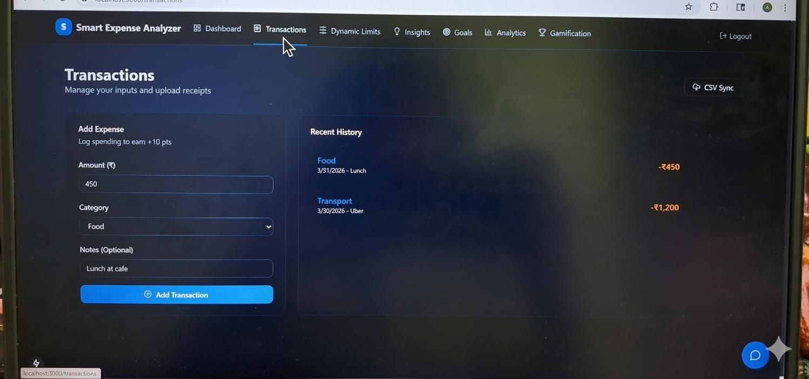
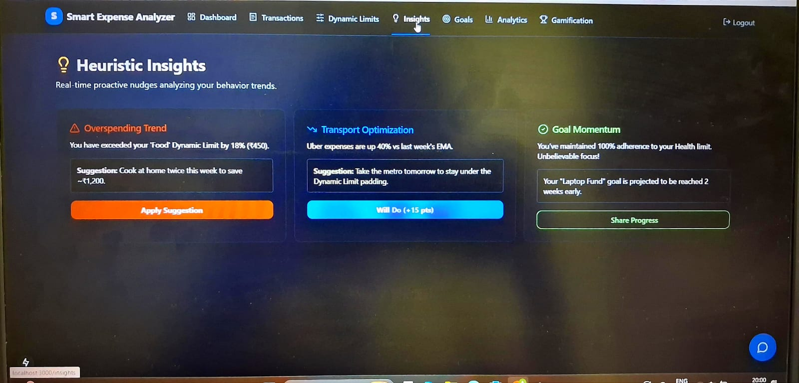
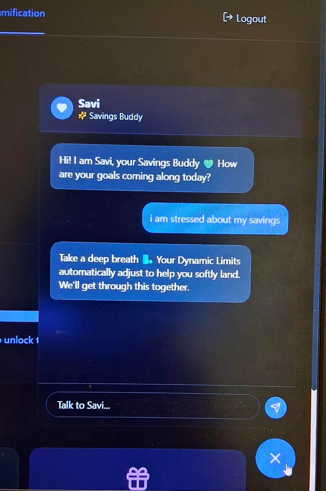

# 💰 Smart Expense Analyzer

## 📌 Overview

Smart Expense Analyzer is an intelligent financial management application designed to help users track expenses, analyze spending patterns, and improve savings through data-driven insights.

Unlike traditional expense trackers, this application integrates an AI-powered chatbot (Savi) that provides both financial guidance and emotional support, helping users manage stress related to spending and savings.

This project was developed using AI-assisted tools (Antigravity & Emergent), combining product thinking with modern web technologies to build a real-world application.

---

## 🚀 Features

* 📊 Interactive dashboard showing balance, income, expenses, and streak tracking
* 💳 Expense and transaction tracking system
* 📈 Data-driven insights for better financial decision-making
* 🎯 Goal tracking and gamification elements
* 🤖 AI chatbot (Savi) for emotional and financial support
* 📅 Monthly history analysis with personalized feedback

---

## 🧠 Key Highlights

* Designed a user-centric financial assistant focusing on both financial management and emotional well-being
* Integrated an AI chatbot to support users dealing with financial stress and decision-making challenges
* Demonstrates modern AI-assisted development workflow using real-world tools
* Structured using a scalable, component-based architecture for maintainability

---

## 🛠 Tech Stack

* Next.js
* React
* TypeScript
* Tailwind CSS

---

## 📸 Screenshots

### 📊 Dashboard View

Displays overall financial summary including balance, income, and expense tracking.

---

### 💳 Transactions

Shows categorized transactions for better financial tracking and monitoring.

---

### 📈 Insights

Provides analysis of spending behavior to help users improve financial habits and avoid overspending.

---

### 🤖 Savi Chatbot

AI-powered assistant that offers emotional and financial guidance to support better decision-making.

---

## 🎯 Impact

* Helps users understand and control their spending habits
* Encourages better financial discipline through insights and feedback
* Provides emotional support alongside financial guidance, making it a holistic solution

---

## 🔮 Future Improvements

* Real-time in-app alerts for spending behavior
* Enhanced chatbot intelligence
* Advanced financial prediction features

---

## 👤 Author

Akshara P P
Data Analyst Enthusiast|Interested in AI-driven applications
